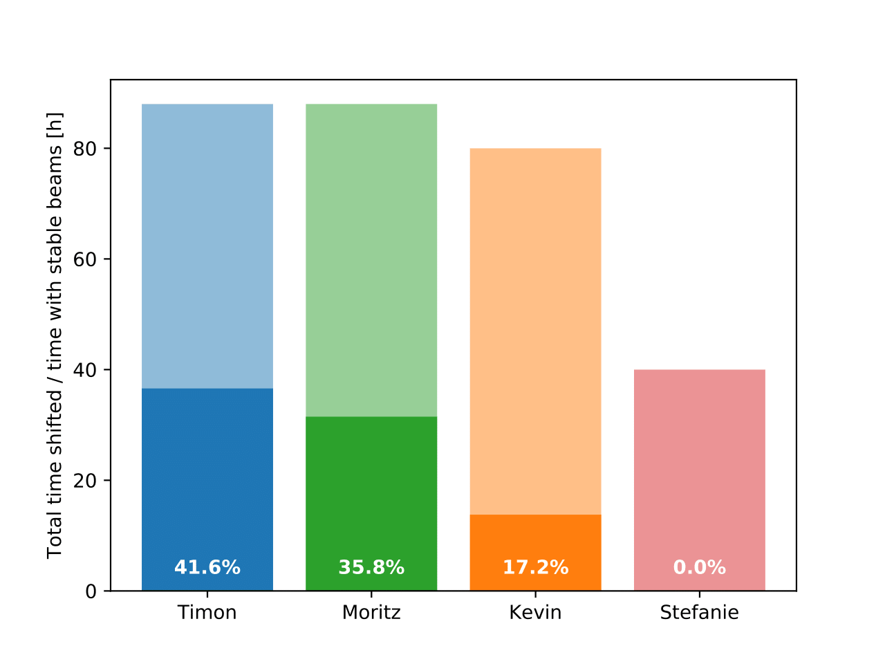
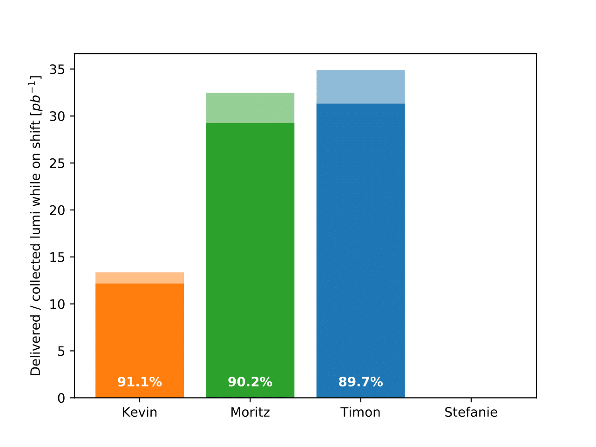

# shiftsum
Summarizes and plots lhcb DM/SL shifts.

### Basic usage
1. Install via pip: `pip install shiftsum`
2. Download the latest rum summary file from https://lbrundb.cern.ch (in csv format).
3. Create a shifter file in json format, which contains the names and shifts taken. See example shifter file below.
4. Call the executable:
```
    shiftsum -r /path/to/runfile.csv -s /path/to/shiftfile.json
```
The resulting plots/summary will be stored in the `results/` folder in the current directory (to change this, use the `-o /path/to/results` argument).


### Shifter file example
```
    {
    "shifters": {
        "Jack": {
            "shifts": [
                ["2017-09-19", "night"],
                ["2017-09-21", "morning"]
            ]}, 
        "Jane": {
            "shifts": [
                ["2017-09-18", "evening"],
                ["2017-09-19", "evening"]
            ]}
        }
    }
```

### Example plots


